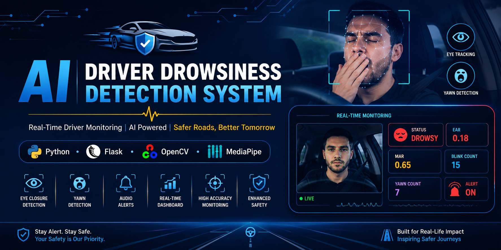

# 🚗 AI Driver Drowsiness Detection System



## 📖 Overview

Driver drowsiness is one of the leading causes of road accidents worldwide. This project presents an AI-powered Driver Drowsiness Detection System that continuously monitors a driver's facial movements through a webcam to identify signs of fatigue in real time.

The system uses Computer Vision with OpenCV and MediaPipe Face Mesh to analyze Eye Aspect Ratio (EAR) and Mouth Aspect Ratio (MAR). When prolonged eye closure or yawning is detected, it immediately triggers an audio alert and updates a live dashboard with the driver's status, blink count, yawn count, and other monitoring information.

This project demonstrates the practical application of Artificial Intelligence and Computer Vision for enhancing road safety through real-time driver monitoring.

---

## ✨ Features

- 👁️ Real-time Eye Aspect Ratio (EAR) Monitoring
- 🥱 Mouth Aspect Ratio (MAR) Based Yawn Detection
- 🚨 Audio Alert for Drowsiness Detection
- 📊 Live Dashboard
- 📈 Blink Counter
- 📈 Yawn Counter
- 📷 Live Camera Feed
- 🌐 Flask Web Application

---

## 🎯 Project Highlights

- Real-time Driver Drowsiness Detection using Computer Vision
- Face Landmark Detection using MediaPipe Face Mesh
- Eye Aspect Ratio (EAR) based Eye Closure Detection
- Mouth Aspect Ratio (MAR) based Yawn Detection
- Live Monitoring Dashboard with Driver Status
- Automatic Audio Alert for Drowsiness Detection
- Blink Counter and Yawn Counter
- Flask-based Web Application
- Modular Python Project Structure
- Lightweight and Easy to Run

---

## 🛠️ Tech Stack

| Category | Technology |
|----------|------------|
| Programming Language | Python |
| Backend Framework | Flask |
| Computer Vision | OpenCV |
| Face Detection | MediaPipe Face Mesh |
| Numerical Computing | NumPy |
| Scientific Computing | SciPy |
| Frontend | HTML, CSS, JavaScript |
| IDE | Visual Studio Code |
| Version Control | Git & GitHub |

---

## 📂 Project Structure

```text
Driver-Drowsiness-Detection-System/
│
├── assets/
│   └── banner.png
│
├── screenshots/
│   ├── dashboard.png
│   ├── awake.png
│   └── drowsy.png
│
├── static/
│   ├── style.css
│   ├── script.js
│   └── alarm.wav
│
├── templates/
│   └── index.html
│
├── app.py
├── mediapipe_detector.py
├── detector.py
├── ear.py
├── mar.py
├── alarm.py
├── requirements.txt
├── LICENSE
└── README.md
```

---

## ⚙️ Installation & Usage

### 1. Clone the Repository

```bash
git clone https://github.com/Abhishek06786/Driver-Drowsiness-Detection-System.git
```

### 2. Navigate to the Project Folder

```bash
cd Driver-Drowsiness-Detection-System
```

### 3. Install Dependencies

```bash
pip install -r requirements.txt
```

### 4. Run the Application

```bash
python app.py
```

### 5. Open in Your Browser

```
http://127.0.0.1:5000
```

---

## 📸 Screenshots

### Dashboard


### Driver Awake


### Drowsiness Detected


---

## 🚀 Future Improvements

- Driver Identity Recognition
- Mobile Application Integration
- Cloud-based Monitoring Dashboard
- Driver Distraction Detection
- Seat Belt Detection
- Multi-Driver Monitoring
- Night Vision Camera Support
- Driver Fatigue Analytics
- Email & SMS Emergency Alerts

---

## 📄 License

This project is licensed under the **MIT License**. See the [LICENSE](LICENSE) file for more details.

---

## 👨‍💻 Author

**Abhishek Choubey**

- GitHub: https://github.com/Abhishek06786
- LinkedIn: https://www.linkedin.com/in/abhishek-choubey-9635082a5/

---

## ⭐ Support

If you found this project useful, please consider giving it a ⭐ on GitHub.